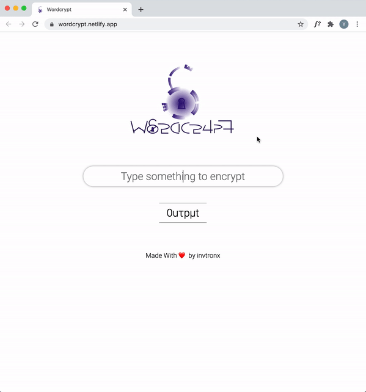

# WordCrypt

WordCrypt generates cryptic English words masked with numbers and Greek alphabets that humans can miraculously understand.

## Preview

## Live Website

WordCrypt is live at [wordcrypt.netlify.app](https://wordcrypt.netlify.app/).

## License

**[MIT license](http://opensource.org/licenses/mit-license.php)**
